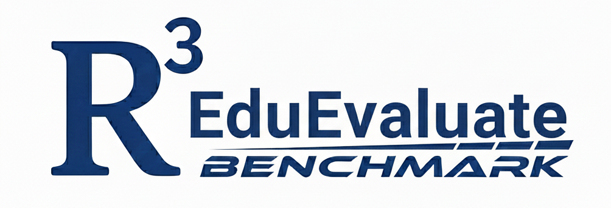

EDUMARS
<div align="center">
  
  <h1>EduMARS: A Multimodal Benchmark for Rubric-aligned Evaluation</h1>
  <h3>Realistic, Cognitively Demanding, K-12 Student Answer Grading</h3>
</div>

<br>

## 📖 Abstract

Automated grading of student work is a critical application of AI in education. However, existing benchmarks fall short in evaluating models on **realistic**, **cognitively demanding** tasks. Most rely on synthetic, well-structured text inputs, overlooking the multimodal, error-prone, and often handwritten nature of real student responses, especially in K-12 settings. 

We introduce **EduMARS**, a multimodal benchmark designed for rubric-aligned evaluation of real Chinese K-12 student answers. The dataset contains over **4,500 authentic responses** from high-stakes exams across eight subjects, featuring:
- ✍️ **Noisy handwriting**
- 📊 **Mixed-layout diagrams**
- ➗ **Mathematical expressions**
- 🧠 **Narrative reasoning**

Each response is meticulously annotated by expert teachers using step-wise scoring rubrics, error classifications, and key-point mappings, providing fine-grained supervision aligned with real-world pedagogical practices. 

To bridge the performance gap between SOTA MLLMs and humans, we propose **Retrieval-Augmented Adaptive-Rubric Grading (RARG)**, enabling models to emulate expert grading logic by dynamically synthesizing case-specific evaluation schemas.

---

## 📂 Repository Structure

```text
.
├── Logo.png                               # Project Logo
├── README.md                              # This file
├── minidataset/                           # Sample dataset directory
├── data_with_paddle_ocr_with_label.json   # Data file containing OCR results and Labels
├── eval_llm_score.py                      # Script for calculating evaluation metrics
├── main_local.py                          # Main script for running the grading pipeline
└── utils.py                               # Utility functions (data loading, processing)
